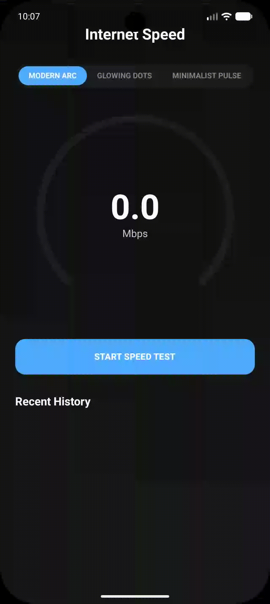
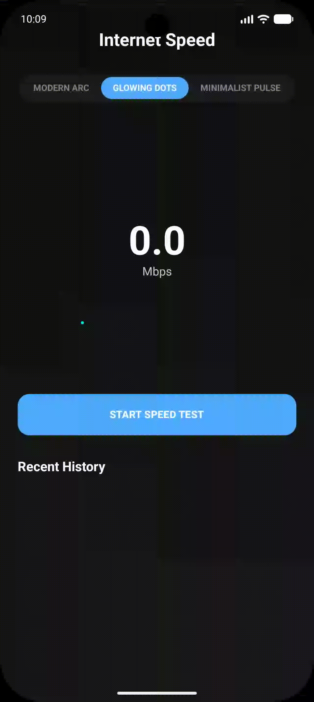
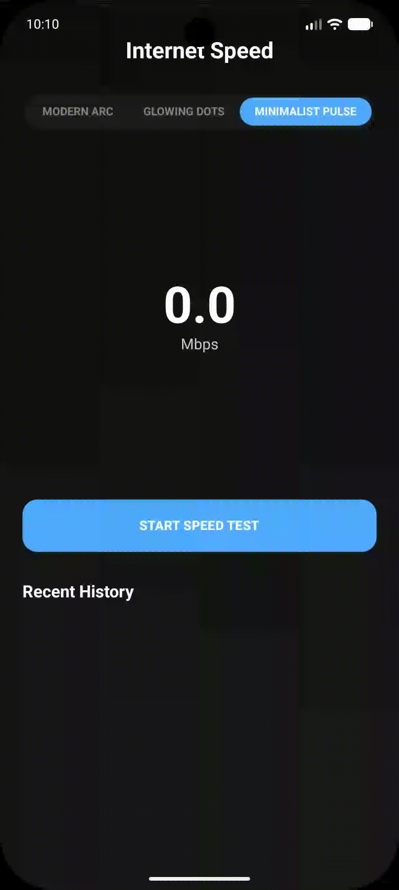

# 🚀 Internet Speed Test (Kotlin & Compose)

[](https://github.com/amjad-awad-allah/internetSpeed/actions/workflows/android.yml)
[](https://kotlinlang.org/)
[](https://opensource.org/licenses/MIT)
[](https://developer.android.com)

<p align="center">
  
</p>

A premium, high-performance Internet Speed Test application for Android, built from the ground up with **Kotlin** and **Jetpack Compose**. This project goes beyond simple measurement, providing a professional-grade network analysis experience with a state-of-the-art UI.

---

## 📸 Demo

| Speedometer Animation | Real-time Chart | Compatibility Analysis |
| :---: | :---: | :---: |
|  |  |  |

---

## ✨ Key Features

- **🎨 Dynamic Speedometer**: Multiple animation styles (Modern Arc, Glowing Dots, Minimalist Pulse) using Jetpack Compose Canvas for high-performance rendering.
- **📊 Real-time Speed Chart**: Visualizes speed fluctuations during testing with a smooth Bezier-curve graph.
- **🛡️ Streaming Readiness Analysis**: Intelligent check for 4K/HD video compatibility and Online Gaming suitability (Ping/Jitter analysis).
- **⏳ Test History**: Keeps track of your previous results with persistent storage and detailed timestamps.
- **💎 Premium UI**: Modern dark-themed design featuring neon gradients, glassmorphism effects, and micro-animations.
- **🧩 Modular Architecture**: Clean separation between UI components and speed test logic for maximum reusability.

---

## 🛠 Technology Stack

- **Language**: [Kotlin 2.3.20](https://kotlinlang.org/)
- **UI Framework**: [Jetpack Compose](https://developer.android.com/jetpack/compose)
- **Networking**: [OkHttp 4.12](https://square.github.io/okhttp/)
- **Build System**: Gradle 9.4.1 (Java 25+ Support)
- **Architecture**: MVVM (Model-View-ViewModel)

---

## 🚀 Getting Started

### Prerequisites
- Android Studio Ladybug (or newer)
- JDK 25+
- An Android device or emulator (API 24+)

### Installation
1. **Clone the repo**:
   ```bash
   git clone https://github.com/amjad-awad-allah/internetSpeed.git
   ```
2. **Open in Android Studio**:
   Import the project and wait for Gradle to sync.
3. **Run on Device**:
   Connect your Android phone via USB (with Debugging enabled) and hit **Run**.

---

## 📦 Library Usage

You can now use the Speedometer UI and logic as a standalone library in your own projects.

### 1. Add JitPack repository
In your `settings.gradle.kts` (or root `build.gradle`):
```kotlin
dependencyResolutionManagement {
    repositories {
        maven { url = uri("https://jitpack.io") }
    }
}
```

### 2. Add dependency
In your app module's `build.gradle.kts`:
```kotlin
dependencies {
    implementation("com.github.amjad-awad-allah:internetSpeed:1.0.0")
}
```

### 3. Implementation Example
```kotlin
// In your Composable
SpeedGauge(
    speed = 150f, 
    style = GaugeStyle.MODERN_ARC,
    primaryColor = Color.Cyan,
    secondaryColor = Color.Blue,
    strokeWidth = 20f,       // New: Gauge thickness
    valueFontSize = 72,      // New: Text size
    animationDuration = 2000 // New: Smoothness
)
```

---

## 📂 Project Structure

```text
androidApp/
├── src/main/kotlin/com/example/internetspeed/
│   ├── MainActivity.kt        # Main Entry Point
│   ├── logic/                 # Speed Test Manager & Networking
│   └── ui/                    # Modular Compose Components
│       ├── SpeedGauge.kt      # Custom Canvas Gauge
│       ├── SpeedChart.kt      # Bezier Speed Graph
│       └── Compatibility.kt   # Analysis Cards
```

---

## 🤝 Contributing

Contributions are what make the open source community such an amazing place to learn, inspire, and create. Any contributions you make are **greatly appreciated**.

Please see [CONTRIBUTING.md](CONTRIBUTING.md) for details on our code of conduct and the process for submitting pull requests.

---

## 📄 License

Distributed under the MIT License. See [LICENSE](LICENSE) for more information.

---

## 📬 Contact

Amjad Awad Allah - [GitHub](https://github.com/amjad-awad-allah)

Project Link: [https://github.com/amjad-awad-allah/internetSpeed](https://github.com/amjad-awad-allah/internetSpeed)
